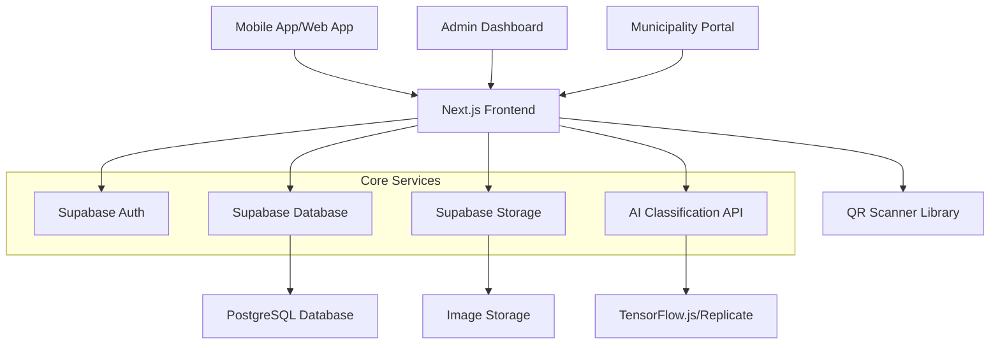
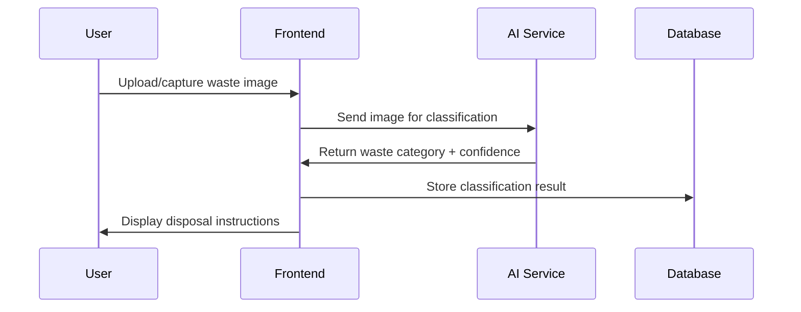
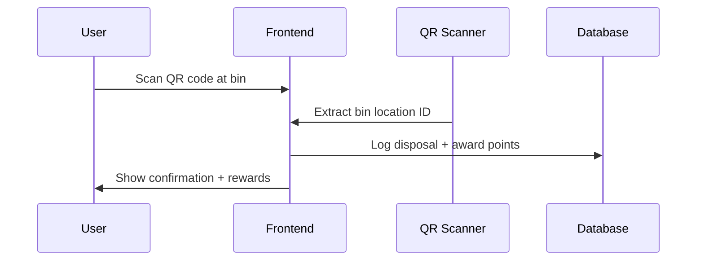

# EcoSort AI - System Architecture

## Overview
EcoSort AI is an AI-powered waste categorization and recycling incentive platform designed for African cities. The system uses image recognition, QR code tracking, and gamification to encourage proper waste disposal.

## Tech Stack
- **Frontend**: Next.js 14 (App Router, TypeScript)
- **UI Framework**: shadcn/ui + TailwindCSS
- **Backend**: Supabase (Auth, Postgres, Storage, Edge Functions)
- **AI**: TensorFlow.js / Replicate API for waste classification
- **Charts**: Recharts
- **Maps**: Mapbox GL JS (optional)
- **QR Code**: qr-scanner library

## System Architecture

## Database Schema

### Users & Authentication
- `profiles` - User profiles with roles
- `auth.users` - Supabase auth users

### Waste Management
- `waste_logs` - Waste classification and disposal records
- `qr_locations` - QR code locations for bins
- `bins` - Physical bin information
- `bin_status` - Real-time bin status (IoT simulation)

### Rewards System
- `rewards` - User reward transactions
- `leaderboard` - User rankings
- `achievements` - User badges and milestones

## Key Features Flow

### 1. AI Waste Detection Flow

### 2. QR Code Disposal Flow

## Security & Performance

### Security
- Supabase RLS (Row Level Security) policies
- JWT token-based authentication
- Input validation and sanitization
- Rate limiting on API endpoints

### Performance
- Image optimization with Next.js Image component
- Lazy loading for dashboard components
- Caching strategies for AI model results
- CDN for static assets

### Africa-Specific Optimizations
- Low bandwidth mode (compressed images)
- Offline-first architecture for core features
- Progressive Web App (PWA) capabilities
- Mobile-first responsive design

## API Architecture

### Server Actions (Next.js)
- Waste classification processing
- QR code validation and logging
- Reward calculations
- User profile management

### Supabase Edge Functions
- AI model inference (if using external API)
- Image processing and optimization
- Real-time notifications
- Data aggregation for analytics

## Deployment Architecture

### Production Environment
- **Frontend**: Vercel (Next.js)
- **Backend**: Supabase (managed service)
- **AI Model**: Replicate API or self-hosted TensorFlow
- **Storage**: Supabase Storage
- **CDN**: Vercel Edge Network

### Development Environment
- Local Supabase development
- Next.js development server
- Mock AI responses for testing
- Local PostgreSQL for development

## Monitoring & Analytics

### Application Monitoring
- Vercel Analytics
- Supabase Dashboard
- Custom error tracking
- Performance metrics

### Business Analytics
- Waste categorization accuracy
- User engagement metrics
- Disposal frequency patterns
- Geographic waste distribution

## Scalability Considerations

### Database Scaling
- Read replicas for dashboard queries
- Partitioning for large waste_logs table
- Indexing strategy for common queries

### AI Model Scaling
- Model versioning and A/B testing
- Fallback to simpler models for high load
- Batch processing for image classification
- Model fine-tuning with local data

## Future Enhancements

### Phase 2 Features
- Real-time IoT bin sensors
- Mobile money integration
- Multi-language support
- Advanced analytics and ML insights

### Phase 3 Features
- Partner organization integration
- Waste pickup scheduling
- Community challenges
- Carbon footprint tracking
